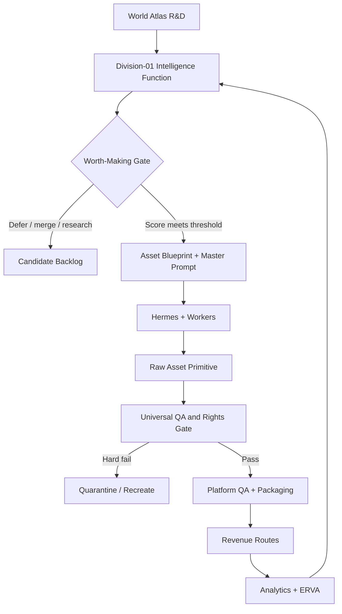
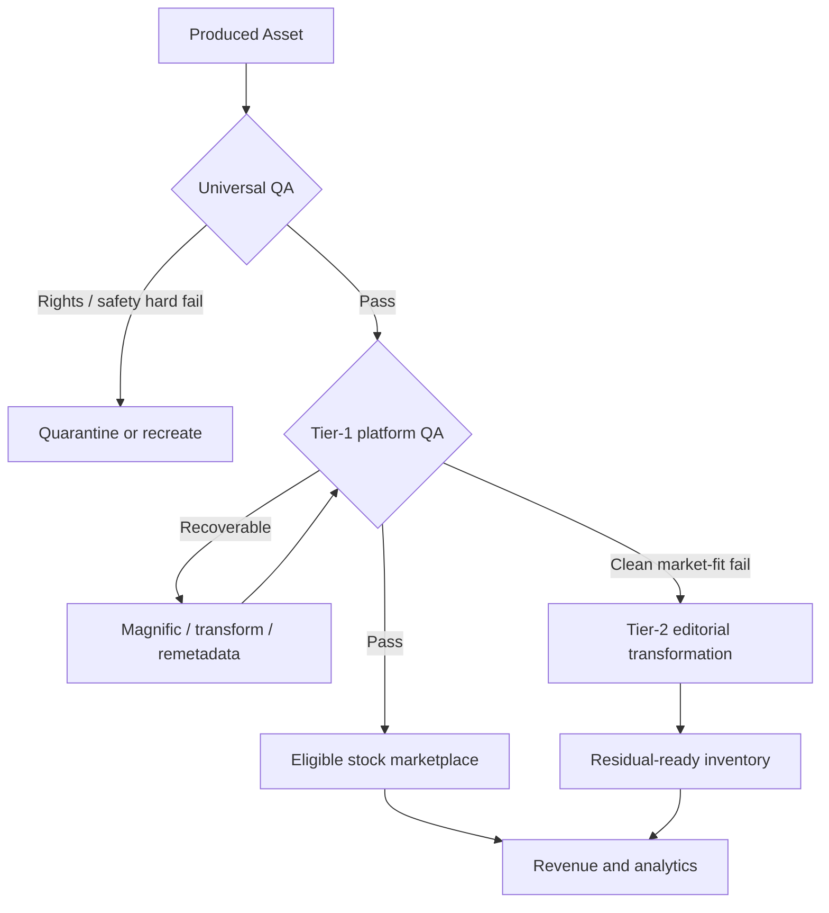

# M-001 T1: Blueprint Batch-1 v2 — Human-Centric Quantity Engine

**Mission:** M-001 — Unbranded Product Universe
**Task:** T1 — Founder Worth-Making Blueprint
**Status:** FOUNDER-RATIFIED v2 — governed mission design; no execution authority
**Date:** 2026-08-24
**Ratified by:** Founder Dee on 2026-08-24
**Spend:** USD 0 — research and design only
**Authorization:** No production, upload, publication, account action, or spend is authorized by this document
**Prepared by:** Chief Executive Architect DEV
**Inputs:** World Atlas, Digital Income Pipeline Map v0.1, Batch-1 draft v1, Founder Quantity Directive, actual-income screenshot archive, supplied architecture diagram

---

## 0. Executive Decision

This v2 accepts the Founder doctrine:

> **Division-01 is a quantity engine governed by intelligence, not a low-volume studio governed by arbitrary production caps.**

The first 12 masters remain accepted as seed opportunity lanes. They are not the total scope of the Human-Centric Demand Atlas and they are not twelve mandatory simultaneous production commitments.

V2 adds a thirteenth, evidence-backed seed:

> **MASTER-13 — Boring Utilities / Human-Centric Object Families.**

The permanent `4 masters/month × 3 months` cadence is removed. It is replaced by an event-driven sequence:

```text
RESEARCH
→ PRODUCE A CONTROLLED VALIDATION BATCH
→ APPROVE
→ LICENSE
→ MEASURE ERVA
→ SCALE TO 50–100 ASSETS/DAY
→ TARGET 1K–5K ASSETS/MONTH
```

The 20–40 asset validation batch is an **unlock test**, not a monthly ceiling.

---

## 1. Strategic Alignment

### 1.1 Holdings North Star

The Founder establishes `$1B in three years` as a holdings-level BHAG evaluated
through **net profit and annualized run-rate**. The two measures are reported
side by side and are never added as if they describe the same accounting
period.

| Measure | Canonical meaning |
|---|---|
| Net profit | Gross revenue less all attributable platform fees, tool/compute costs, and valued operating time |
| Annualized run-rate | Latest normalized monthly net profit multiplied by 12 |
| Gross revenue | Diagnostic input; never a substitute for net profit |
| Valuation | Possible outcome; never the operating target |

The `$1B/3Y` BHAG is a scalability design constraint, not a stock-royalty
forecast and not permission to weaken evidence gates.

### 1.2 M-001 Purpose

M-001 has one bounded job:

```text
Research
→ produce
→ approve
→ license
→ measure ERVA
→ scale
```

M-001 must prove one primitive economic loop before the wider Digital Income Empire activates the remaining fourteen divisions.

### 1.3 Operating Doctrine

```text
Build → Run → Verify → Refactor → Extend
Build → Ship → Pecah Telor → Improve
```

The system optimizes for:

- Founder time saved;
- 24/7 useful throughput;
- high research-to-production conversion;
- high valid-asset yield;
- fast evidence acquisition;
- scalable distribution;
- portfolio compounding; and
- reusable intelligence across future divisions.

---

## 2. What Changed from v1

| Area | v1 | v2 decision |
|---|---|---|
| Master registry | 12 masters | 12 retained + evidence-backed MASTER-13 |
| Cadence | 4 masters/month × 3 months | Event-driven unlock; 50–100 assets/day after proof |
| Quantity | Implicitly throttled | 1k–5k/month post-validation capacity target |
| World Atlas | Trend-led research summary | Human-Centric Demand Atlas becomes primary R&D source |
| QA | Pass/fail gate | Universal veto + route-specific QA + recovery routing |
| Zero Trash | Not operationalized | Residual asset routing state machine |
| Magnific | Mixed with distribution cohort | Production/recovery lane, not stock marketplace |
| Economics | Projected 12-month return | Observed ERVA and asset-day telemetry |
| Platform dependency | `<60%` precondition | Post-launch risk monitor; not an impossible pre-data gate |
| Scale trigger | Calendar | Approval, license, ERVA, QA, and duplicate-safety events |
| Evidence | Trend reports | Adds actual-income archive with strict evidence labels |

---

## 3. Corrected System Architecture



### 3.1 Critical Semantics

`KILL` before production means **kill or defer the hypothesis**, preserving production capacity. It does not destroy a produced asset.

`Hard fail` after production means the asset has a universal defect such as unresolved IP, watermark, deceptive content, unsafe content, or unrecoverable technical/anatomical failure. It must not be dumped onto social platforms.

`Tier-1 fail` means the asset may still be commercially clean but unsuitable for one marketplace, redundant for one portfolio, or technically recoverable. That asset may be transformed or routed elsewhere.

---

## 4. World Atlas R&D Layer

### 4.1 Candidate-Space Equation

Division-01 explores:

```text
HUMAN
× ACTIVITY
× OBJECT
× PLACE
× TIME
× DEMOGRAPHIC
× EMOTION
× PROBLEM
× INDUSTRY
× COMMERCIAL INTENT
```

The theoretical candidate space is:

```text
CandidateSpace =
|Human| × |Activity| × |Object| × |Place| × |Time|
× |Demographic| × |Emotion| × |Problem| × |Industry|
× |CommercialIntent|
```

No fixed “billions of ideas” number is canon until each dimension has a counted registry and deduplication rules. The important fact is combinatorial abundance; production capacity remains scarce and must be allocated intelligently.

### 4.2 R&D Branches

```text
Human Existence
├── Activities & Lifecycle
├── Objects & Systems
├── Emotions & States
└── Contexts
    ├── place
    ├── time
    ├── demographic
    ├── problem
    ├── industry
    └── commercial intent
```

### 4.3 Atlas Candidate Record

Each candidate must carry:

```yaml
candidate_id: atlas-candidate-id
human_role: null
activity: null
object: null
place: null
time: null
demographic: null
emotion: null
problem: null
industry: null
commercial_intent: null
target_buyer: []
potential_asset_types: []
evidence: []
status: observed|inferred|hypothesis|unknown
```

The Atlas is a search space, not a production queue.

---

## 5. Worth-Making Gate v2

### 5.1 Hard Vetoes

A candidate cannot enter production when any of these remain unresolved:

- third-party intellectual property or trademark dependence;
- prohibited real-person or artist imitation;
- unclear commercial rights from the production tool;
- harmful, deceptive, or unsafe intended use;
- platform type is not eligible under the current Platform Contract;
- required upfront spend above Founder-authorized budget;
- no falsifiable buyer or commercial-use hypothesis.

### 5.2 Opportunity Score

| Factor | Weight |
|---|---:|
| Demand evidence | 20 |
| Commercial intent | 15 |
| Buyer utility | 15 |
| Competition gap | 10 |
| Visual scarcity / differentiation | 10 |
| Production feasibility | 10 |
| Eligible-platform fit | 10 |
| Repurposing potential | 5 |
| Speed to cheapest falsification | 5 |
| **Total** | **100** |

### 5.3 Decision Bands

| Score | State | Action |
|---:|---|---|
| 75–100 | Validation candidate | Produce a 20–40 asset micro-batch after Founder gate |
| 60–74 | Research backlog | Acquire missing evidence, narrow the context, or merge with another family |
| Below 60 | Defer / kill hypothesis | Do not spend production capacity |

The score is a decision instrument, not fabricated market precision. Confidence must be reduced when evidence is weak.

### 5.4 Evidence Labels

Every important claim must be labeled:

- `OBSERVED` — directly visible in marketplace or receipt;
- `VERIFIED` — supported by current official source or executed receipt;
- `INFERRED` — reasoned from evidence but not directly measured;
- `HYPOTHESIS` — designed to be falsified;
- `UNKNOWN` — unavailable and not invented.

---

## 6. Accepted Seed Registry

The masters are opportunity lanes. They do not cap the Atlas and do not all enter production simultaneously.

| ID | Master | Primary mode | Evidence priority | Initial-phase note |
|---|---|---|---|---|
| 01 | Playful Glitch Entities | Raster/vector conceptual | P2 exploratory | Free-capability path required |
| 02 | Unfiltered Moments | Lifestyle raster | P2 compliance-heavy | People/release risk must be resolved |
| 03 | Micro-Travel Reels | Vertical video | P2 | Paid-video assumptions blocked at USD 0 |
| 04 | Neon-Pastel Geometry | Raster/vector backgrounds | P1 | Good zero-cost test candidate |
| 05 | Clean Intelligence | B2B tech illustration | P1 | Commercial intent strong; competition must be measured |
| 06 | Quiet Rituals | Wellness/object raster | P1 | Adjacent to observed utility demand |
| 07 | Kinetic Type & Transitions | Motion templates | P2 | Handcraft/tool capacity required |
| 08 | Everyday Business & Life | Commercial staples | **P0** | Strongest v1 alignment with actual evidence |
| 09 | Launch System | Brand/template system | P2 | Direct-product economics, not primitive stock only |
| 10 | Quarterly Drops | Seasonal multi-format | P1 | Timing and submission lead-time required |
| 11 | Tiny Worlds | 3D library | P3 future lane | Not initial-phase production-ready |
| 12 | Sound-Designed Motion | Audio-visual templates | P3 future lane | Rights/tooling not yet validated |
| 13 | **Boring Utilities / Object Families** | Isolated raster/illustration | **P0 evidence-backed** | First primitive cashflow laboratory |

### 6.1 MASTER-13 — Boring Utilities / Human-Centric Object Families

**Thesis:** Simple, recognizable, reusable objects can generate licenses when they solve broad design and communication needs.

Initial semantic territories:

```text
Food & drink
Botanical & floral
Household & decor
Education & simple symbols
Travel & nature objects
Everyday tools and accessories
```

Commercial uses include:

- educational material;
- invitations and greeting cards;
- blog and editorial illustration;
- social design;
- menus and food communication;
- packaging and decorative composition;
- stickers, printables, and patterns;
- presentation and website accents.

The initial evidence shows watercolor-like isolated objects on clean backgrounds repeatedly appearing as best sellers and accumulating visible downloads. This is evidence of demand, not proof that every similar asset will sell.

MASTER-13 must avoid shallow duplicate production. Variations require a meaningful change in object, use case, context, composition, buyer utility, or semantic story.

---

## 7. Asset Blueprint Contract

Every production micro-batch requires an executable blueprint:

```yaml
blueprint_id: M001-BP-XXXX
master_id: MASTER-XX
candidate_dimensions:
  human: null
  activity: null
  object: null
  place: null
  time: null
  demographic: null
  emotion: null
  problem: null
  industry: null
  commercial_intent: null

buyer:
  persona: []
  use_cases: []
  job_to_be_done: null

evidence:
  marketplace: []
  external: []
  actual_income: []
  labels: observed|verified|inferred|hypothesis|unknown

worth_making:
  score: 0
  confidence: low|medium|high
  hard_vetoes_clear: false

production:
  asset_type: null
  visual_language: null
  semantic_variation_plan: []
  batch_size: 20-40
  engines_eligible: []
  master_prompt: null
  negative_constraints: []

platforms:
  eligible_marketplaces: []
  required_profiles: []
  technical_transforms: []
  ai_disclosures: []

metadata:
  title_direction: null
  primary_keywords: []
  secondary_keywords: []
  categories: {}

qa:
  universal_checks: []
  platform_checks: {}
  duplicate_distance_rule: null

economics:
  expected_cost_usd: 0
  expected_asset_days_to_signal: null
  revenue_claim_status: hypothesis
```

The Asset Blueprint is the contract between `division-head-division01`, acting
through its Digital Asset Intelligence function, and Hermes. Workers execute
the blueprint; they do not silently change the commercial hypothesis.

---

## 8. Production Unlock and Scaling

### 8.1 Event-Driven Stages

| Stage | Purpose | Exit evidence | Capacity state |
|---|---|---|---|
| U0 — Research | Find a worth-making family | Score ≥75, vetoes clear, Founder approval | No production |
| U1 — Validation | Prove production and QA | 20–40 distinct assets; ≥80% universal-QA pass; zero hard-rights failures | Controlled micro-batch |
| U2 — Approval | Prove distribution primitive | At least one asset accepted on an eligible Tier-1 marketplace; rejection reasons logged | Submission continues within validated family |
| U3 — License | Prove money primitive | At least one paid license receipt | Unlock up to 50 assets/day for that family |
| U4 — ERVA | Measure portfolio yield | Positive observed ERVA with sufficient accepted asset-days; duplicate rejection controlled | Unlock up to 100 assets/day; portfolio target 1k–5k/month |
| U5 — Portfolio | Optimize compounding | Stable or improving ERVA, approval yield, route utilization, and cost | Replicate and open adjacent Atlas families |

### 8.2 Provisional Calibration Thresholds

These thresholds are provisional and must be ratified or revised from real receipts:

- universal QA pass rate: `≥80%`;
- hard compliance failure: `0` for items routed to publication;
- similarity/duplicate rejection: `<10%` within a scaled family;
- first license: required before U3 scale;
- ERVA observation: measured from accepted asset-days, not calendar assumptions;
- scale increases: event-triggered, not automatically scheduled.

### 8.3 No Permanent Volume Cap

Once U4 is reached, production volume is bounded only by:

```text
research quality
× unique blueprint supply
× generator throughput
× QA throughput
× eligible submission capacity
× platform policy headroom
× positive ERVA
```

Founder may pause or redirect a family when marginal ERVA, acceptance yield, or differentiation deteriorates.

---

## 9. QA as Routing Logic

### 9.1 Universal Gate

Every produced asset must pass before any public route:

- commercial rights and tool-license provenance;
- no unresolved third-party IP, logo, trademark, or protected character;
- no watermark or unwanted signature;
- no unsafe, deceptive, or prohibited content;
- anatomy, geometry, object integrity, and text integrity;
- minimum aesthetic coherence;
- lineage to blueprint, prompt, engine, and source evidence.

### 9.2 Platform Gate

Only then apply platform-specific checks:

- accepted content type;
- AI policy and disclosure;
- format, resolution, color, codec, duration, and file-size rules;
- metadata and category rules;
- similarity tolerance;
- releases;
- contributor eligibility;
- upload and payout constraints.

### 9.3 QA Result States

```text
T1_PASS
T1_RECOVERABLE
T1_MARKET_FIT_FAIL
T2_READY_AFTER_TRANSFORM
QUARANTINE_RIGHTS
QUARANTINE_SAFETY
RECREATE_TECHNICAL
ARCHIVE_RESEARCH_ONLY
```

There is no generic `FAIL → social` route.

---

## 10. Zero Trash Routing v2

> **Zero Trash means no economically usable asset is discarded without route evaluation. It does not mean every generated file must be published.**



### 10.1 Active Tier-1 Revenue Cohort

The M-001 distribution cohort is:

1. Adobe Stock;
2. Dreamstime;
3. 123RF;
4. Vecteezy; and
5. MotionElements.

Eligibility is per asset type. An asset is not automatically sent to all five platforms.

### 10.2 Production / Recovery Lane

Magnific is classified as:

```text
generate / upscale / edit / reframe / recover
```

It is not counted as the sixth stock revenue marketplace unless a separately verified monetization contract exists.

### 10.3 Tier-2 Residual Surfaces

Potential surfaces:

- Facebook;
- Instagram;
- YouTube Shorts;
- TikTok;
- Pinterest;
- X; and
- Threads.

Required transformation may include:

- 9:16, 1:1, 4:5, or platform-native framing;
- sequence or carousel design;
- caption and keyword package;
- narrative, education, commentary, or utility;
- motion, voiceover, or sound where appropriate;
- disclosure and rights checks;
- campaign grouping rather than repetitive bulk posting.

Division-01 may create `residual-ready inventory`, but publication and monetization belong to the future Audience/Content division when that authority is activated. M-001 does not silently activate Division A.

### 10.4 Future Packaging Routes — Not Active in M-001

- Creative Market, Etsy, and other direct digital products;
- Webflow, Roblox, Unity, and platform-native assets;
- print-on-demand;
- PDF/knowledge products;
- commercial bundles and B2B licenses.

These are expansion routes, not current production authorization.

---

## 11. Metadata and Semantic Coverage

Metadata is created from the blueprint, not improvised after generation.

Each platform package must contain:

- accurate title;
- ranked primary keywords;
- relevant secondary keywords;
- native category;
- AI disclosure state;
- release state;
- target buyer/use case;
- object and context dimensions;
- asset-family identifier.

Semantic coverage should expand buyer utility without keyword stuffing:

```text
OBJECT
→ object subtype
→ activity or use
→ context
→ emotion/problem
→ industry
→ commercial use
```

---

## 12. Economics and ERVA

### 12.1 Core Metric

`ERVA` means **Expected Revenue per Valid Asset-Day**.

One valid asset-day is one eligible, accepted, live asset on one marketplace for one calendar day. The same source asset live on two marketplaces creates two valid route-days because each route has its own acceptance, visibility, license events, and royalty economics.

For each platform:

```text
Observed ERVA_p =
Net Royalty Revenue_p
÷ Valid Live Asset-Days_p

Equivalent decomposition:
ERVA_p =
Licenses per Valid Asset-Day_p
× Net Revenue per License_p
```

Acceptance yield remains a separate production metric:

```text
Valid Route Yield_p =
Accepted Live Routes_p
÷ Assets Submitted_p
```

Keeping these measures separate prevents acceptance from being counted twice.

Portfolio revenue is measured across asset vintages:

```text
DailyRevenue_t =
Σ (LiveAcceptedAssets by platform and vintage × Observed ERVA)
```

No fixed cross-platform independence or `5 sales per 100 assets per day` assumption is canon before receipts exist.

### 12.2 Tier-1 + Tier-2 Combined Economics

Tier-1 ERVA proves the current M-001 licensing primitive. Once Tier-2 publication is separately authorized and attributable revenue exists, the holdings-level view is:

```text
Combined Attributable Revenue_t =
Tier-1 Net Licensing Revenue_t
+ Tier-2 Net Attributable Revenue_t

Source Asset Yield_t =
Combined Attributable Revenue_t
÷ Unique Source Asset-Days_t
```

Rules:

- one source asset is counted once in the denominator even when transformed into several routes;
- each revenue event must retain `asset_id`, route, platform, period, and net amount;
- Tier-2 revenue is `0 / UNKNOWN`, never projected as earned, until Division A is activated and receipts exist;
- repurposing potential may improve the Worth-Making score, but an unverified Tier-2 estimate cannot justify production by itself;
- source-asset yield complements ERVA; it does not replace route-level acceptance and licensing metrics.

Revenue concentration is monitored after launch:

```text
Route Concentration_t =
Largest Route Net Revenue_t
÷ Combined Attributable Revenue_t
```

`<60%` is the desired diversification state when at least two monetized routes and a meaningful observation window exist. It is not a pre-revenue approval gate and cannot be claimed while Tier-2 remains inactive.

### 12.3 Required Telemetry

| Metric | Purpose |
|---|---|
| Research candidates/day | R&D throughput |
| Blueprints passing Worth-Making/day | intelligence yield |
| Raw assets/day | generator throughput |
| Universal-QA pass rate | production quality |
| Platform acceptance rate | distribution fit |
| Rejection reason distribution | correction priority |
| Accepted asset-days | ERVA denominator |
| Licenses and royalty/platform | revenue evidence |
| Time to first approval | operational latency |
| Time to first license | market latency |
| Revenue per accepted asset | portfolio yield |
| Duplicate/similarity rejection | saturation warning |
| Recovery rate via Magnific/transform | salvage efficiency |
| Residual-ready asset rate | Zero Trash utilization |
| Tier-2 monetized yield | cross-division evidence, when active |
| Cost per valid accepted asset | unit economics |
| Founder time per 1,000 assets | autonomy efficiency |

### 12.4 Evidence from Actual-Income Archive

Observed evidence from 37 screenshots:

- 30 sampled Adobe daily-account cards total `$74.37`;
- sampled account-day mean and median are approximately `$2.48`;
- visible sampled daily range is `$0.83–$3.67`;
- one direct ledger shows three custom licenses: `$1.32`, `$1.94`, and `$2.03`;
- visible published assets show approximately `20–55` downloads on selected portfolio pages;
- recurring subjects include food, botanical, household, travel, decorative, and simple-symbol assets.

Evidence boundaries:

- daily-card revenue is account-wide, not the royalty of the displayed best seller;
- portfolio pages overlap and cannot be summed into total portfolio sales;
- total portfolio size and zero-download denominator are unknown;
- acceptance rate and production cost are unknown;
- the archive validates economic possibility, not a universal sale velocity.

---

## 13. Roles, Authority, and Canonical State

| Actor | Authority |
|---|---|
| Founder | Final strategy, Worth-Making approval, spend, submission authority during initial phase, capital allocation |
| `chief-executive-architect-dev` | Founder-invoked architecture, security, contracts, and design verdicts; no runtime production authority |
| `division-head-division01` | Division research, scoring, Asset Blueprints, prompts, and learning recommendations through the Digital Asset Intelligence function |
| `hermes-operator` | Mission orchestration, sequencing, retries, worker allocation, and verification |
| Workers / Proxima / Web AI | Execute bounded tasks and produce receipts |
| QA / Metadata workers | Evaluate and package; cannot waive hard vetoes |
| DIE State Manager | Single physical writer of canonical Company Truth |

Hermes is an orchestration authority, not the canonical truth store. Workers do not self-authorize production, publication, spend, or cross-division activation.

“Digital Asset Intelligence Director” is a Division-01 function, not a new
registered identity, transport lane, or control plane.

---

## 14. Canonical Asset Lineage

Every asset must have a stable identity:

```text
M001-{MASTER}-{FAMILY}-{CONCEPT}-{VARIANT}-{ENGINE}-{VERSION}
```

Minimum manifest:

```yaml
asset_id: null
blueprint_id: null
candidate_id: null
master_id: null
prompt_hash: null
engine: null
generated_at: null
source_path: null
rights_state: null
universal_qa_state: null
platform_routes: {}
metadata_versions: {}
submission_receipts: []
license_receipts: []
revenue_events: []
residual_routes: []
```

This lineage prevents duplicate submission, false attribution, lost revenue history, and contaminated feedback.

---

## 15. M-001 Definition of Done

M-001 is complete only when the following chain has verified receipts:

```text
Research receipt
→ Founder-approved Asset Blueprint
→ production receipt
→ universal-QA receipt
→ platform submission receipt
→ approval receipt
→ paid license receipt
→ ERVA calculation
→ scale recommendation
```

Success is not defined by producing 100 files or writing 12 master descriptions.

Success is:

> **one complete economic primitive that can be repeated and scaled without requiring Founder attention for every asset.**

---

## 16. Founder Ratification — v2 Decisions

Founder Dee ratified the following design decisions on 2026-08-24:

1. `MASTER-13 Boring Utilities` as the P0 evidence-backed primitive lane.
2. Opportunity Score weights and `≥75` validation threshold.
3. U0–U5 event-driven production unlock.
4. Post-license scale to 50 assets/day and post-ERVA scale to 100 assets/day.
5. Portfolio target of 1k–5k assets/month as capacity, not guaranteed output.
6. Zero Trash routing with universal hard-fail quarantine.
7. Five revenue marketplaces + Magnific production/recovery classification.
8. Division-01 ownership of residual-ready inventory without prematurely activating Division A.
9. `$1B/3Y` as the holdings BHAG measured through net profit and annualized run-rate.
10. No production/upload/spend authorization until the five-marketplace + Magnific contract matrix and final Founder gate are complete.

Ratification makes this document governed M-001 design canon. It does not
authorize production, upload, publication, account action, or spend.

---

## 17. Dependencies Before Production Authorization

- current Platform Contract for Adobe Stock;
- current Platform Contract for Dreamstime;
- current Platform Contract for 123RF;
- current Platform Contract for Vecteezy;
- current Platform Contract for MotionElements;
- Magnific tool/license/cost contract;
- five-marketplace + Magnific technical and AI-policy matrix;
- production-engine commercial-rights matrix;
- final validation family selection;
- explicit submission and spend authorization.

The hypothesis `Adobe 10% acceptance versus other platforms 80%` remains unverified until actual receipts exist.

---

## 18. Immediate Post-Approval Sequence

```text
1. Register ratified v2 as governed M-001 mission canon
2. Complete five-marketplace + Magnific contract matrix
3. Select one or more P0 validation families
4. Produce executable Asset Blueprints
5. Founder authorizes the bounded 20–40 asset validation batch
6. Hermes assigns production and QA
7. Founder-controlled first submission
8. Capture approval/rejection receipts
9. Capture first paid license
10. Compute ERVA
11. Issue scale / refactor / kill-family verdict
```

---

## 19. Non-Goals

This document does not:

- activate the remaining fourteen income divisions;
- authorize 1k–5k assets immediately;
- guarantee cross-platform acceptance or revenue;
- authorize paid Midjourney, Runway, Topaz, Suno, Udio, Magnific, or other subscriptions;
- treat social platforms as a dumping ground;
- claim that every generated asset has economic value;
- replace current official platform policies;
- authorize automatic platform posting;
- mutate live canonical state.

---

## 20. Final Doctrine

```text
THE ATLAS CREATES ABUNDANCE.
THE DIRECTOR CREATES SELECTIVITY.
HERMES CREATES CONTINUITY.
WORKERS CREATE THROUGHPUT.
QA CREATES ROUTING CONFIDENCE.
DISTRIBUTION CREATES MARKET CONTACT.
ERVA CREATES TRUTH.
SCALE MULTIPLIES WHAT THE MARKET PROVES.
```

> **Simplicity can produce the first dollar. Intelligence decides what deserves quantity. Quantity compounds only after evidence.**

---
