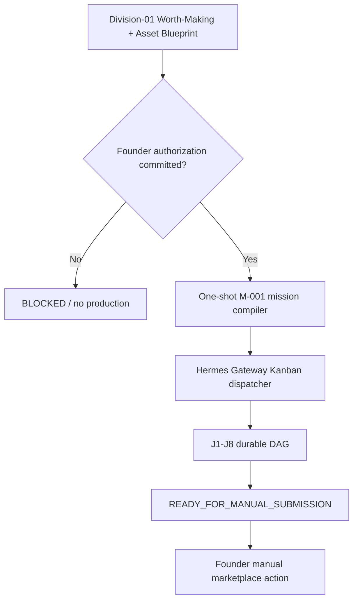

# M-001 Closed-Loop Runner v1

**Status:** GOVERNED IMPLEMENTATION — dormant until a Founder production-authorization decision is committed

**Scope:** M-001 U1, from an approved executable Asset Blueprint through a
verified manual-submission package. This runner does not upload, publish, spend,
open accounts, claim marketplace approval, record a license, or calculate ERVA.

## 1. Architectural verdict

No production cron and no second daemon are added.

Hermes Gateway already contains a durable Kanban dispatcher with a 60-second
dispatch interval. The missing primitive was a governed compiler that turns one
authorized U1 request into idempotent, dependency-linked jobs. The runtime is:



The four existing cron schedules remain deterministic health, catch-up,
briefing, and audit mechanisms. They do not invoke an LLM or initiate
production. Continuous operation comes from the already-running Hermes Gateway
dispatcher, not from repeatedly prompting Hermes on a clock.

## 2. Authority preflight

`bin/m001_loop.py` refuses to materialize any card unless all checks pass:

1. the request identifies `M-001` and a safe, unique `M001-U1-*` run ID;
2. the Asset Blueprint is executable, scores at least 75, clears every hard
   veto, names a falsifiable buyer job, covers every semantic variation, and
   carries current production-engine commercial-rights references;
3. one exact decision exists in canonical `state/DECISIONS.jsonl`;
4. that decision is Founder-authored and `committed_by=die-state-manager`;
5. the decision class is `production_authorization` and the choice is
   `authorize_u1_validation_batch`;
6. its committed blueprint SHA-256 matches the supplied file;
7. `batch_size` is 20–40, canary size is 5, and maximum cost is USD 0.00;
8. production is authorized while submission and publication are explicitly
   false; and
9. authority evidence includes canon assimilation, Division-01 Worth-Making,
   platform-contract matrix, and production-engine-rights receipts.
   The evidence set also requires the verified Proxima durable artifact-export
   probe; a text response alone is not an image artifact. Every evidence row
   must be `VERIFIED` and carry a resolvable reference plus SHA-256.
10. the production authorization carries a future expiry timestamp. Expired
    authority fails closed.

A Markdown ratification, conversation message, wake response, local flag, or
Hermes session memory is not execution authority.

### 2.1 Executable Asset Blueprint shape

Division-01 supplies JSON, not a prose prompt. The minimum shape is:

```json
{
  "schema_version": "die.m001.asset-blueprint.v1",
  "mission_id": "M-001",
  "blueprint_id": "M001-BP-*",
  "candidate_id": "CAND-*",
  "master_id": "MASTER-13",
  "buyer": {"job_to_be_done": "...", "use_cases": ["..."]},
  "worth_making": {
    "score": 75,
    "hard_vetoes_clear": true,
    "receipt_ref": "..."
  },
  "production": {
    "batch_size": 20,
    "canary_size": 5,
    "engines_eligible": ["chatgpt"],
    "engine_contract_refs": ["..."],
    "master_prompt": "...",
    "semantic_variation_plan": ["one distinct entry per authorized asset"]
  },
  "qa": {
    "universal_checks": [
      "rights", "safety", "watermark", "lineage", "technical", "visual"
    ],
    "duplicate_distance_rule": "...",
    "technical_requirements": {
      "min_megapixels": 3,
      "allowed_formats": ["PNG", "JPEG"]
    }
  }
}
```

The technical values are derived from the current eligible route contracts;
the example number is not a universal marketplace rule.

### 2.2 Committed authorization payload

The semantic object committed through the Decision Gateway binds the exact
run and blueprint:

```json
{
  "decision_class": "production_authorization",
  "choice": "authorize_u1_validation_batch",
  "mission_id": "M-001",
  "run_id": "M001-U1-*",
  "production_authorized": true,
  "submission_authorized": false,
  "publication_authorized": false,
  "max_cost_usd": 0,
  "batch_size": 20,
  "canary_size": 5,
  "blueprint_sha256": "64 lowercase hex characters",
  "expires_at": "RFC3339 timestamp",
  "authority_evidence": [
    {
      "kind": "required evidence kind",
      "ref": "resolvable receipt reference",
      "status": "VERIFIED",
      "sha256": "64 lowercase hex characters"
    }
  ]
}
```

Required evidence kinds are `canon_assimilation`,
`division01_worth_making`, `platform_contract_matrix`,
`production_engine_rights`, and `proxima_artifact_export`. These examples are
schemas, not decisions, and cannot authorize a run.

## 3. Durable J1–J8 graph

| Job | Purpose | Exit artifact | Hermes-card retries |
|---|---|---|---:|
| J1 | Lock the exact executable Asset Blueprint | `LOCK_RECEIPT.json` | 2 |
| J2 | Produce exactly five canary assets through Worker → Proxima | `BATCH_MANIFEST.json` | 0 |
| J3 | Run canary universal QA and require ≥80% pass, zero hard-rights failure | `QA_RECEIPT.json` | 2 |
| J4 | Produce remaining resumable waves to the authorized 20–40 total | `BATCH_MANIFEST.json` | 0 |
| J5 | Run full-batch universal QA and per-asset routing | `QA_RECEIPT.json` | 2 |
| J6 | Recover eligible technical defects or record `NOT_REQUIRED` | `RECOVERY_RECEIPT.json` | 0 |
| J7 | Build route-specific metadata and a manual-submission package | `SUBMISSION_PACKAGE.json` | 2 |
| J8 | Mechanically verify J1–J7 and stop at the human boundary | `LOOP_RECEIPT.json` | 2 |

`max_retries=3` means an initial attempt plus two automatic retries. Networked
production/recovery jobs use `max_retries=1`: ambiguous network outcomes are
not regenerated by Hermes. Proxima may still perform its own bounded transport
retry; the Worker therefore uses a stable asset ID and treats any ambiguous
artifact-export outcome as `BLOCKED`. Every job carries `PROGRESS.md`, a bounded
`JOB.json`, one workspace, explicit acceptance criteria, and an idempotency
key. J2–J8 depend on the preceding card, so the dispatcher cannot run them in
parallel or cross a failed gate.

All eight cards are first created as `blocked`. The compiler writes every job
envelope and the durable `RUN.json` before releasing them together. Parent
dependencies then promote only the next eligible card. Re-running the compiler
with the same plan is a no-op; a changed blueprint or plan hash in the same
workspace is rejected.

The canary and remaining production are decomposed into one-asset Worker jobs,
run sequentially by the single v0 Worker. J4 uses five-asset waves at the
Hermes-card level; this does not add a second Worker or parallel production.

## 4. Role flow

| Actor | Runtime responsibility |
|---|---|
| Division-01 | Research, Worth-Making score, and exact Asset Blueprint |
| Founder | Commits the bounded U1 production authority and later performs/authorizes submission |
| M-001 compiler | Mechanically validates authority and materializes the durable graph |
| Hermes | Orchestrates each card, delegates a bounded Worker job, verifies evidence, sequences/retries |
| Worker | Executes one job in one workspace; never receives holdings strategy or submission credentials |
| Proxima / Creator | Produces or transforms an artifact only for J2/J4/J6 through Worker |
| QA worker + QA engine | Supplies visual-review evidence and runs deterministic universal checks |
| State Manager | Remains the sole canonical writer; runner workspaces are evidence, not Company Truth |

Hermes cards explicitly prohibit Hermes from producing the asset in its own
context. Proxima remains a production gateway, never a cognitive or control
lane.

## 5. Executable universal QA

`bin/m001_asset_qa.py` consumes a `die.m001.asset-batch.v1` manifest and emits a
`die.m001.universal-qa-receipt.v1` receipt. It checks:

- unique asset IDs and exact-binary duplicates;
- source path confinement and SHA-256;
- structurally valid PNG/JPEG containers and blueprint-specified dimensions;
- prompt, blueprint, candidate, master, engine, and source lineage;
- resolvable rights, safety, watermark, lineage, technical, and visual review
  evidence; and
- per-asset Blueprint v2 routing state.

Deterministic code does not pretend to judge anatomy or aesthetics. A bounded
human or vision-model review must write a durable evidence receipt; if it is
missing, the asset becomes `REVIEW_REQUIRED` and the batch becomes
`BLOCKED_REVIEW`.

Rights and safety failures route only to `QUARANTINE_RIGHTS` or
`QUARANTINE_SAFETY`. Low-resolution assets become `T1_RECOVERABLE` only when an
eligible recovery path is declared. Nothing implements a generic
`FAIL → social` route.

## 6. Upscale and Magnific boundary

J6 is conditional, but mandatory as a receipt:

- already compliant asset → `NOT_REQUIRED`, cost USD 0.00;
- eligible zero-cost transform → Worker may execute and re-run QA;
- Magnific without a verified entitlement/credit/cost receipt → `BLOCKED`;
- any non-zero cost without a new Founder decision → `BLOCKED`;
- unresolved rights/safety failure → quarantine, never upscale around the veto.

This lets the first batch complete without unnecessary upscaling while keeping
the full Generate → QA → Upscale/Not-Required → Package chain auditable.

## 7. Operator commands after merge and explicit authorization

First validate without changing runtime:

```powershell
python C:\DIE\bin\m001_loop.py plan `
  --request C:\DIE\workspaces\M001-U1-001\LOOP_REQUEST.json
```

Only after the plan is reviewed, materialize the graph:

```powershell
python C:\DIE\bin\m001_loop.py materialize `
  --request C:\DIE\workspaces\M001-U1-001\LOOP_REQUEST.json
```

The command performs a live doctor check for
`dispatch_in_gateway: true`, an observable dispatch interval, and a running
Hermes Gateway, plus an enabled `chatgpt` model in Proxima's loopback model
registry, before it creates cards. It does not start or restart a service or
send a production prompt.

At J8, mechanical verification is:

```powershell
python C:\DIE\bin\m001_loop.py verify-run `
  --run-root C:\DIE\workspaces\M001-U1-001
```

The only successful J8 status is `READY_FOR_MANUAL_SUBMISSION`. Manual
submission receipts, marketplace review, a paid license, and ERVA belong to
subsequent U2–U4 events and remain outside this runner.

## 8. Recovery and 24/7 semantics

Hermes Gateway wakes the next ready card within its configured dispatch
interval. A process restart does not erase Kanban status, `RUN.json`,
`PROGRESS.md`, artifacts, or evidence. The next worker resumes rather than
regenerates an existing asset ID.

“24/7” therefore means continuously dispatchable and restart-resumable while a
card is eligible. It does not mean unconditional infinite generation. A failed
QA threshold, missing visual review, unavailable entitlement, exhausted budget,
or human submission gate intentionally leaves the graph blocked until new
governed evidence arrives.

The stale unassigned v1 root card is not silently edited by the compiler. It is
inert and must be reconciled separately through normal Hermes/state procedure.

## 9. Deployment boundary

Merging this implementation makes the machinery available; it does not run it.
Post-merge deployment is:

1. fast-forward `C:\DIE` while preserving runtime-owned state;
2. run Company Brain and bridge regression;
3. have Division-01 produce the executable Asset Blueprint and Worth-Making
   receipt;
4. commit the exact Founder U1 production decision through State Manager;
5. run `plan`, review the derived J1–J8 graph, then run `materialize`;
6. observe the five-asset canary before the remaining production waves; and
7. keep marketplace submission manual until the Founder changes that authority.
