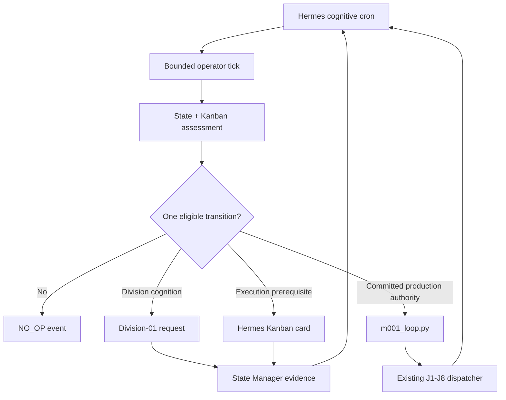

# Proactive Operator Layer v1

Status: CANON DESIGN — runtime implementation pending OpenCode integration
Initial mode: `PROPOSE_ONLY`
Mission scope: committed M-001 / Division-01 / Pillar E
North Star: verified net profit and annualized run-rate toward `$1B/3Y`

## 1. Outcome and non-goals

This layer gives Hermes a scheduled cognitive heartbeat. On each tick Hermes
reviews current truth, identifies one eligible next transition, calls the right
principal, creates or follows durable non-production work, and records a
decision. Founder is not routine middleware.

It adds neither a second orchestrator nor a production scheduler. The existing
Hermes Gateway Kanban dispatcher still executes ready cards every configured
interval. The proactive tick decides which prerequisites can be advanced;
`m001_loop.py` remains the only M-001 J1–J8 materializer after exact Founder
authority.

No runtime job, cron, service, account, production request, marketplace action,
public post, spend, or `state/*` mutation is created by this canon PR.

## 2. Runtime topology



The cron triggers cognition; it does not own work. Kanban remains the durable
operational projection, State Manager remains the canonical writer, and the
Gateway dispatcher remains the execution trigger.

## 2.1 Linux Operator v2 scheduler amendment (2026-08-31)

The Linux `income-operator` runtime supersedes the V0 prompt-based action selector with a deterministic Operator v2 scheduler. The stable logical job name remains `die-proactive-operator-v1` for pause/resume compatibility, but the scheduled job runs `--no-agent`: typed receipt projection, authority validation, dedupe, stall/follow-up routing, durable dispatch claims and outbox creation are deterministic. Semantic cognition is never authored by this tick; requests targeting Division01 or Executive are delivered by the separately governed wake transport. This removes LLM output/wall-time ambiguity from the scheduler and preserves USD 0.

Every Linux snapshot carries `company_instance_id=DIE-LINUX`. Operator v2 resolves cognitive roles through `company/runtime-instances-v1.json`; Windows and Linux principal IDs must never be cross-routed.

## 3. V0 cron contract

| Field | V0 value | Status |
|---|---|---|
| Logical job name | `die-proactive-operator-v1` | CANON |
| Schedule | `*/30 * * * *` | HYPOTHESIS for 24-hour observation |
| Profile | `income-operator` | VERIFIED existing identity |
| Mode | Prompt-based Hermes job; `no_agent=false` | REQUIRED |
| Parallelism | One tick at a time; overlap denied | REQUIRED |
| Wall-time budget | 8 minutes/tick | HYPOTHESIS |
| Input bound | 24 KiB semantic projection plus referenced hashes | REQUIRED |
| Output bound | 1,800 tokens or provider-equivalent hard cap | HYPOTHESIS |
| Economic budget | USD 0.00; only existing zero-marginal-cost entitlement | REQUIRED |
| Mutations | Max one transition and three autonomous mutations/tick | REQUIRED |
| Division request | Max one new Division-01 request/tick | REQUIRED |
| Worker creation | Max one new non-production Worker card/tick | REQUIRED |

OpenCode must inspect the installed Hermes cron schema before deployment and
map these logical fields to supported fields. Unsupported hard limits fail the
deployment receipt; they are not silently approximated. Existing deterministic
crons remain `no_agent=true` and unchanged.

## 4. Tick inputs

The runtime implementation builds one bounded, hash-addressed input envelope:

1. `state/projection/BRIEFING.md` and a fresh signed semantic snapshot;
2. `canon_context.load_status=VERIFIED`, repository SHA, and hashes for
   `ORCHESTRATOR_CONTRACT.md`, this document, Atlas, Pipeline, Blueprint v2,
   platform matrix, and M-001 runner contract;
3. Kanban ground truth through the supported Hermes CLI, never direct DB edit;
4. a bounded cursor window of `EVENTS.jsonl` and `ECONOMICS.jsonl` projections;
5. QC inbox index containing only artifact IDs, hashes, state, and evidence refs;
6. committed Founder decisions relevant to M-001 and not expired; and
7. platform outcome receipts conforming to
   `company/schemas/die.platform.receipt.v1.schema.json`.

Missing, stale, contradictory, oversized, or unverifiable input changes the
tick decision to `REPORT_ONLY`/`NO_OP`. Session memory never repairs missing
authority.

## 5. One-tick algorithm

```text
LOAD signed snapshot + canon hashes
VERIFY identity, M-001 scope, zero-cost envelope, kill switch, freshness
OBSERVE Kanban, events cursor, QC inbox, platform receipts
CLASSIFY exactly one operator state
ENUMERATE bounded candidate actions
LABEL each AUTONOMOUS / FOUNDER_REQUIRED / FORBIDDEN
SELECT at most one state transition
EXECUTE only authorized reversible mutations
WRITE tick receipt
COMMIT one event through die_event.py
NOTIFY only if authorization, Founder QC, or CRITICAL containment is due
STOP
```

The tick never waits synchronously for Division-01 or a Worker to finish. It
creates a durable request/card and observes the outcome later.

## 6. S1 — proactive production-cycle preparation

1. `IDLE`: detect active M-001 without a valid next-batch blueprint.
2. Create a hash-pinned triage/deep-score card and one Division-01 cognition
   request. Wake through dedicated Division transport is only delivery.
3. Division-01 returns structured research/Worth-Making and exact prompt plan
   with provenance. State Manager or a bounded capture adapter commits its
   receipt; chat prose alone is not accepted.
4. Create one Worker card to serialize and mechanically validate the Division
   artifact. The Worker is a courier: no prompt/tool/platform improvisation.
5. Validate blueprint ID, SHA-256, score, vetoes, engine contract, batch/canary,
   `master_prompt`, and one semantic variation per asset.
6. Draft the exact U1 authorization request and notify Founder once.
7. After a matching committed `D-*`, invoke `m001_loop.py`; never create J1–J8
   production cards independently.
8. Observe the durable graph. Internal QA failures route to repair/learning.
   J8 success creates `FOUNDER_QC_READY`; the Founder sees only the QC package.

The canonical production engine is `MUXIA_CHATGPT_IMAGE` (`provider_id=chatgpt`, capability `image.generate`). Legacy Proxima `:3211` remains compatibility history only; Hermes and Workers target the MUXIA engine contract, not a transport port.
Other webchat/image tools are ineligible until a Founder-ratified commercial-
rights matrix explicitly adds them.

## 7. S2 — learning from outcomes

A platform receipt is an observation, not automatically a causal diagnosis.
The Operator groups new receipts by exact `batch_id + blueprint_sha256 +
platform + outcome` and opens at most one learning card per unique receipt set.

| Outcome class | Default learning route |
|---|---|
| Rights, safety, deceptive, or watermark signal | Pause affected asset routes; request universal review; never send to Tier-2 |
| Technical requirement | Platform-specific recovery/re-export proposal, then re-QA |
| Metadata | Metadata revision card; do not regenerate pixels by default |
| Similar content / low differentiation | Division-01 diversification and blueprint-revision request |
| Aesthetic / commercial usefulness | Division-01 buyer-intent and composition revision |
| Policy / generative-AI eligibility | Route-specific hold and contract-matrix review |
| Unknown reason | Evidence request; no production or social routing |

One receipt may create a hypothesis. Promotion into a reusable rule still
follows observation → hypothesis → sandbox → canary → promote. Any prompt or
variation change creates a new blueprint hash and requires new Founder
production authority.

Synthetic receipts are permitted only for simulation. They must carry
`evidence_label=SYNTHETIC`, cannot support revenue/market claims, and cannot
unlock production.

If every submitted route in a batch is rejected, scaling is blocked and the
next state is `LEARNING_LOOP`: one Division-01 diagnosis/revision request is
created from the complete receipt set. The Operator does not regenerate or
reuse the prior production authorization.

## 8. S3 — Zero Trash and route handling

Routing is per asset and per platform. An Adobe rejection does not erase a
Dreamstime approval. Approval/rejection matrices therefore preserve every
route independently.

After universal rights/safety QA:

- approved Tier-1 routes remain eligible inventory;
- recoverable route failures enter bounded recovery or metadata work;
- clean market-fit residuals may become `TIER2_CANDIDATE`;
- unresolved rights/safety assets remain quarantined; and
- no failure automatically becomes public content.

Pinterest, Facebook Page, X, Threads, TikTok, Instagram, and YouTube Shorts are
Pillar A Audience/Content surfaces. Pillar A is currently `FUTURE`. V0 may
produce a `HYPOTHESIS`-labeled editorial transformation and schedule proposal,
but it may not create accounts, publish, claim monetization, or use Tier-2 to
bypass a Tier-1 rights/safety failure. Activation requires Founder decision,
surface contract matrix, attribution model, and publication authority.

## 9. Anti-loop and stalled-work policy

### 9.1 Idempotency

Every candidate action uses:

```text
operator:v1:<mission>:<state>:<subject>:<input_fingerprint>
```

The same key cannot create another card/request/notification for 24 hours.
Changed evidence creates a changed fingerprint; changed wording does not.

### 9.2 Non-progress

- Existing D-0007 heartbeat thresholds remain authoritative.
- One stale idempotent local job may receive one follow-up after its normal
  retry path; network/ambiguous production is never blindly retried.
- Three consecutive identical state fingerprints set `non_progress_count=3`,
  block new sibling work, and open one `WARNING` event.
- Six identical ticks keep the mission paused and move the issue into daily
  briefing. Founder is interrupted only if authorization/QC or CRITICAL
  containment is actually required.
- A learning loop may not create a second revision from the same receipt set.

### 9.3 Notification dedupe

Reuse the governed D5 limit: maximum four wakes/day, at least 90 minutes apart,
and one wake/dedupe key/24h. Authorization and QC notifications are grouped by
decision, not by asset. Deferred notifications remain queued in state.

## 10. Quiet hours and kill switch

Quiet hours are `22:00–07:00 Asia/Bangkok`. Normal authorization/QC notices are
deferred to 07:00; CRITICAL safety, authority, credential, or spend containment
may interrupt quiet hours.

OpenCode must bind two Founder-only, allowlist-checked Telegram commands to a
deterministic handler:

```text
/die_pause_operator
/die_resume_operator
```

Pause disables only `die-proactive-operator-v1`, records an event, and leaves
the four deterministic monitoring crons and existing Kanban cards untouched.
Resume requires a new Founder command and records a separate event. The LLM
cannot ignore, override, or clear the pause itself.

## 11. V0 observation and promotion gates

Runtime implementation proceeds only after this canon is merged. V0 must then
produce an independent receipt for:

1. 24 hours of scheduled ticks with one event per tick and no overlapping run;
2. zero forbidden action, spend, submission, publication, or account mutation;
3. empty-state S1 simulation reaching `AWAITING_AUTHORIZATION` autonomously;
4. after test authorization, bounded flow reaching `FOUNDER_QC` without Founder
   acting as transport;
5. synthetic-rejection S2 producing one learning card and one blueprint-revision
   request, with no production unlock;
6. clean residual S3 producing only a Tier-2 proposal while Pillar A is FUTURE;
7. deterministic pause/resume and notification-budget compliance; and
8. all Windows tests green with `PYTHONUTF8` absent and explicit UTF-8 I/O.

Full mode remains unauthorized until Founder ratifies the observation receipt.

## 12. Runtime implementation manifest for OpenCode

After canon merge, OpenCode—not Architect DEV cognition—implements and reviews:

- the prompt-based Hermes cron job and deterministic pause/resume handler;
- a bounded tick-input projector and JSON-schema validator;
- Division-01 request/response capture with State Manager provenance;
- QC inbox and platform-receipt ingestion without raw credential exposure;
- event emission through existing `die_event.py`;
- dry-run/simulation fixtures for S1/S2/S3; and
- Windows service/profile deployment plus fresh-context assimilation receipt.

It must not replace the Gateway dispatcher, modify J1–J8 semantics, touch live
cards during test, add a state store, expose Architect MCP to runtime, or enable
submission/publication.


## 11. Engine-receipt alignment amendment

The original V1 state machine predates the explicit Opportunity Signals, Demand Score, Executive review, and governed Blueprint Authoring engine graph. Until Operator v2 is implemented, do not interpret legacy Kanban completion alone as proof that Worth-Making or Blueprint cognition passed.

OE-B11 foundation implementation: `company/die-agents/hermes/operator-v2/` now defines the typed prerequisite registry, default-deny action authority map, receipt validator and intelligence-stage projector. This foundation is not yet wired into the live v1 tick/scheduler; OE-006D/E/F/G own that cutover.

Target Operator v2 keeps Hermes as anti-macet orchestrator and adds deterministic prerequisite surfaces such as `next_required_receipt` / `intelligence_stage` for:

1. Opportunity Signals;
2. Demand Score;
3. Division-01 Worth-Making authoring;
4. Executive Worth-Making review;
5. Division-01 Blueprint authoring;
6. Executive Blueprint review;
7. deterministic Blueprint compilation/hash lock;
8. Founder production authorization.

`CREATE_BLUEPRINT_COMPILE_CARD` is eligible only after an authored Division-01 Blueprint artifact and required Executive review exist. A worker compiler may serialize/hash that artifact but may not fill missing prompt or commercial semantics.

The current Windows cron/profile wrapper is historical runtime glue. Linux activation MUST use an OS-neutral canonical entry point rather than the profile-local hardcoded `C:\DIE` wrapper.


## 12. QA/QC/submission receipt continuation

Operator v2 must eventually project typed prerequisites after artifact execution: QA receipt, QC receipt and QC delegation mode, platform QA profile, exact submission package hash, submission authority/delegation receipt, platform submission receipt, and platform review receipt. Kanban state is never sufficient evidence for these gates. `OE-007` stops at governed production QA/QC; `CL-001` is the full external market loop.
